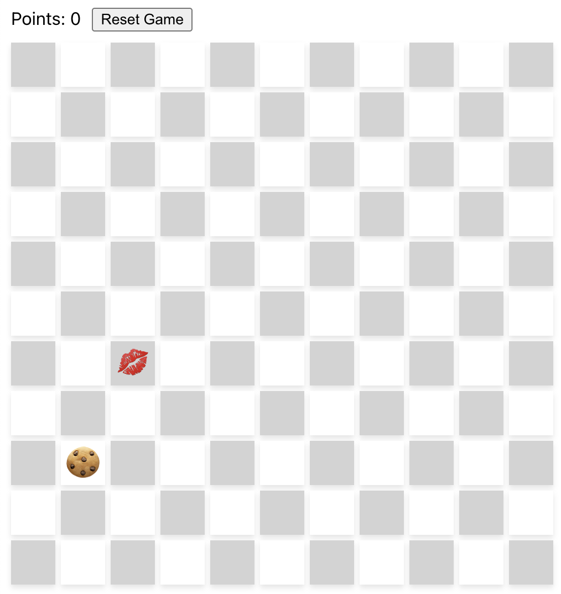

# Cookie Chasing Game

## Introduction
Cookie Chasing Game is a lightweight browser-based game where the player can move and eat cookies on a grid board (11x11 by default).

Once the player eats a cookie, a new cookie will show up in a random cell on the grid board. The total points the player achieves are counted and displayed at the top. By resetting the game, both the target's and player's positions will be reset, and the total points will be cleared immediately.

## Technical Background
This game is built with React. Some technical highlights when designing the game are listed below:

- `useState()`: We use states for tracking and updating the coordinates of player and target on the board.
- `useEffect()`:
    - Event listeners on `"keydown"` events should be added when the main component first gets mounted and removed when it gets unmounted.
    - Whenever player and target positions get updated, there should be a logic that checks if the player reaches the target and updates target location accordingly.
- `display: flex`: Flexbox Layout can actually be used quite ubiquitously - not just for arranging elements horizontally (by default), but also for controlling child elements in general by easily setting properties like `gap`, `justify-content`, and `align-items`.
- `box-shadow`: This can make borders of elements look more natural than directly setting a solid border.
